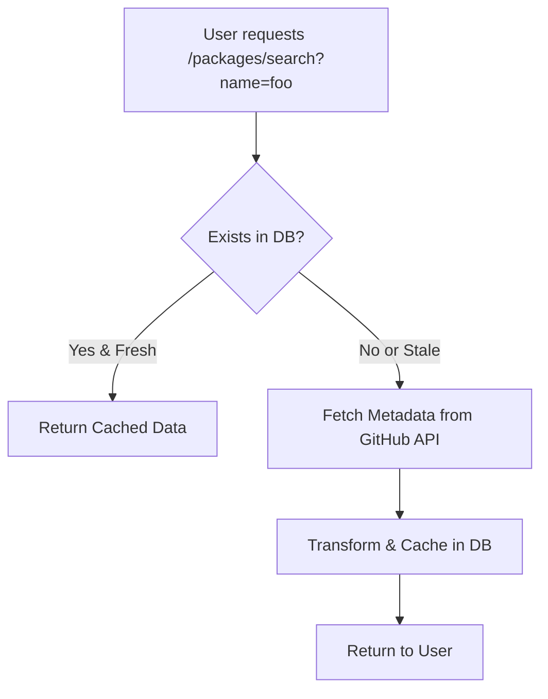

# 📦 Packages Feature - OSS Repository Backend

The **Packages** feature handles package discovery and metadata retrieval using GitHub (and optionally NPM) APIs. It supports on-demand search, caching metadata in the database, and structured endpoints to support the frontend evaluation interface.

---

## 🧠 Feature Overview

### Supported Endpoints

| Method | Endpoint                 | Purpose                                      |
|--------|--------------------------|----------------------------------------------|
| GET    | `/packages/search`       | Search for a package name (GitHub/NPM)       |
| GET    | `/packages/:name/summary`| Get brief overview of package                |
| GET    | `/packages/:name/details`| Fetch detailed metadata & risk signals       |
| GET    | `/packages/:name/similar`| Recommend similar packages                   |

---

## 🔁 Flow Diagram



---

## 🗂 Components

- **PackagesController**: Handles all HTTP routes under `/packages`
- **PackagesService**: Core logic for orchestration
- **PackagesRepository**: Interacts with Package table
- **GitHubService**: Handles GitHub API integration (e.g., stars, forks, pushed_at)
- **(Optional) NpmService**: For NPM-specific info like weekly downloads

---

## 🧱 Database Schema (Prisma)

```prisma
model Package {
  package_id     String   @id @default(uuid())
  package_name   String   @unique
  downloads      Int?
  last_updated   DateTime?
  stars          Int?
  contributors   Int?
  pushed_at      DateTime?
  risk_score     Float?
  fetched_at     DateTime?
  repo_url       String
  repo_name      String

  watchlists     Watchlist[]
}
```

---

## 💡 Caching Strategy

- All data fetched from GitHub is cached in Package table.
- `fetched_at` is used to determine staleness.
- Data is re-fetched if older than 12 hours.

```typescript
isStale(fetchedAt: Date): boolean {
  return differenceInHours(new Date(), fetchedAt) > 12;
}
```

---

## 🔧 Setup Guide

1. **Add .env variable for GitHub token:**

```bash
GITHUB_TOKEN=ghp_XXXX
```

2. **Inject GitHubService into PackagesService**

3. **Use axios or octokit/rest in GitHubService to access:**
   - `/search/repositories?q=<pkg>`
   - `/repos/:owner/:repo`
   - `/repos/:owner/:repo/contributors`

4. **Run migration if needed:**

```bash
npx prisma migrate dev --name init
```

---

## 📌 TODO

- [ ] Implement GitHubService
- [ ] Add staleness check logic
- [ ] Integrate NPM metadata (optional)
- [ ] Unit test repository + service logic